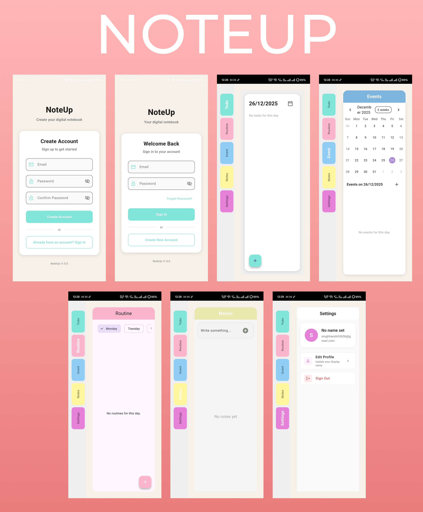

# NoteUp 📝

A beautiful and intuitive Flutter-based productivity app that helps you organize your life with todos, routines, events, and notes - all in one place.

## 📸 App Overview 


## ✨ Features

- **📋 Todo Management**: Create, organize, and track your daily tasks with date-specific organization
- **🔄 Routine Tracking**: Build and maintain healthy habits with routine management
- **📅 Event Planning**: Schedule and manage your important events and appointments
- **📝 Note Taking**: Capture thoughts, ideas, and important information
- **⚙️ Settings**: Personalize your profile and app preferences
- **🔐 Authentication**: Secure Firebase authentication with user profiles

## 🎨 Design

NoteUp features a modern, clean interface with:
- Intuitive side navigation with color-coded sections
- Responsive design that works across different screen sizes
- Beautiful color scheme with custom accent colors
- Smooth transitions and user-friendly interactions

## 🚀 Getting Started

### Prerequisites

- Flutter SDK (latest stable version)
- Dart SDK
- Firebase account for authentication
- Android Studio / VS Code with Flutter extensions

### Installation

1. **Clone the repository**
   ```bash
   git clone https://github.com/yourusername/noteup.git
   cd noteup
   ```

2. **Install dependencies**
   ```bash
   flutter pub get
   ```

3. **Firebase Setup**
   - Create a new Firebase project at [Firebase Console](https://console.firebase.google.com/)
   - Enable Authentication with Email/Password
   - Add your app to the Firebase project
   - Download `google-services.json` (Android) and place it in `android/app/`
   - Download `GoogleService-Info.plist` (iOS) and place it in `ios/Runner/`

4. **Run the app**
   ```bash
   flutter run
   ```

## 📱 Screenshots

*Coming soon - Add screenshots of your app here*

## 🏗️ Project Structure

```
lib/
├── main.dart                 # App entry point
├── todo_home_page.dart       # Main navigation and Todo page
├── routine_page.dart         # Routine management
├── event_page.dart           # Event scheduling
├── my_notes_page.dart        # Notes functionality
├── setting_page.dart         # User settings and profile
└── login_page.dart           # Authentication related files
└── register_page.dart        # Authentication related files

```

## 🔧 Configuration

### Firebase Configuration

Make sure to configure Firebase properly:

1. **Authentication**: Enable Email/Password authentication in Firebase Console
2. **Database**: Set up Firestore (if using for data storage)
3. **Security Rules**: Configure appropriate security rules for your database

### Color Scheme

The app uses a custom color palette:
- Primary: `Color(0xFF81E6D9)` (Teal)
- Secondary: `Color.fromARGB(255, 230, 129, 218)` (Pink)
- Background: `Color(0xFFF5F1E8)` (Warm white)
- Navigation colors: Teal, Pink, Blue, Yellow

## 📋 Features Breakdown

### Todo Management
- ✅ Create tasks for specific dates
- ✅ Mark tasks as complete/incomplete
- ✅ Date picker for task organization
- ✅ Clean, intuitive interface

### User Profile
- ✅ Firebase authentication
- ✅ Display name management
- ✅ Secure sign out functionality

### Navigation
- ✅ Side navigation with color-coded sections
- ✅ Smooth transitions between pages
- ✅ Responsive design

## 🛠️ Built With

- **Flutter** - UI framework
- **Firebase Auth** - Authentication
- **Dart** - Programming language
- **Material Design** - Design system
